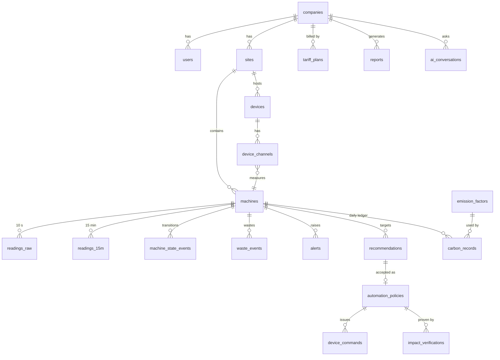

# 04 — Database Design (MySQL 8, Aiven)

## Conventions
- InnoDB, `utf8mb4` / `utf8mb4_0900_ai_ci`. **All timestamps are UTC** `DATETIME`; local time is computed in services using the company timezone.
- Every tenant-owned table has `company_id`. Repositories **require** it; there is no unscoped query path.
- IDs are `INT UNSIGNED AUTO_INCREMENT`, except telemetry, which uses composite natural keys.
- Units are encoded in column names (`_kw`, `_kwh`, `_eur`, `_kg`, `_c`, `_v`, `_a`, `_s`).
- Evidence, parameters and snapshots use `JSON` columns. Everything we query or filter on is a real column.
- Soft-delete (`archived_at`) for machines and devices, so history survives.
- Migrations are numbered `.sql` files in `backend/database/migrations/`, tracked in `schema_migrations`.

## Entity map (core relations)



---

## A. Tenancy and access

```sql
CREATE TABLE companies (
  id INT UNSIGNED AUTO_INCREMENT PRIMARY KEY,
  name VARCHAR(160) NOT NULL,
  legal_form VARCHAR(40) NULL,                 -- e.g. Sh.p.k., N.T.P.  (VSME B1)
  business_number VARCHAR(20) NULL,            -- Kosovo NUI / registration no.
  nace_code VARCHAR(10) NULL,                  -- sector (VSME B1)
  employees SMALLINT UNSIGNED NULL,
  annual_turnover_eur DECIMAL(14,2) NULL,      -- GHG intensity per turnover
  country CHAR(2) NOT NULL DEFAULT 'XK',
  city VARCHAR(80) NULL,
  timezone VARCHAR(40) NOT NULL DEFAULT 'Europe/Belgrade',
  currency CHAR(3) NOT NULL DEFAULT 'EUR',
  locale VARCHAR(5) NOT NULL DEFAULT 'sq',
  emission_factor_id INT UNSIGNED NULL,        -- selected grid factor (FK emission_factors)
  carbon_shadow_price_eur_t DECIMAL(8,2) NULL,
  is_demo TINYINT(1) NOT NULL DEFAULT 0,
  created_at DATETIME NOT NULL DEFAULT CURRENT_TIMESTAMP,
  updated_at DATETIME NULL ON UPDATE CURRENT_TIMESTAMP
);

CREATE TABLE users (
  id INT UNSIGNED AUTO_INCREMENT PRIMARY KEY,
  company_id INT UNSIGNED NOT NULL,
  email VARCHAR(190) NOT NULL UNIQUE,
  password_hash VARCHAR(255) NOT NULL,
  full_name VARCHAR(120) NOT NULL,
  role ENUM('owner','admin','manager','viewer') NOT NULL DEFAULT 'viewer',
  locale VARCHAR(5) NULL,
  last_login_at DATETIME NULL,
  disabled_at DATETIME NULL,
  created_at DATETIME NOT NULL DEFAULT CURRENT_TIMESTAMP,
  FOREIGN KEY (company_id) REFERENCES companies(id) ON DELETE CASCADE,
  INDEX (company_id)
);

CREATE TABLE sessions (
  id INT UNSIGNED AUTO_INCREMENT PRIMARY KEY,
  user_id INT UNSIGNED NOT NULL,
  token_hash CHAR(64) NOT NULL UNIQUE,          -- SHA-256 of the cookie token
  expires_at DATETIME NOT NULL,
  revoked_at DATETIME NULL,
  ip VARCHAR(45) NULL, user_agent VARCHAR(255) NULL,
  created_at DATETIME NOT NULL DEFAULT CURRENT_TIMESTAMP,
  FOREIGN KEY (user_id) REFERENCES users(id) ON DELETE CASCADE
);

CREATE TABLE invitations (
  id INT UNSIGNED AUTO_INCREMENT PRIMARY KEY,
  company_id INT UNSIGNED NOT NULL,
  email VARCHAR(190) NOT NULL,
  role ENUM('admin','manager','viewer') NOT NULL,
  token_hash CHAR(64) NOT NULL UNIQUE,
  expires_at DATETIME NOT NULL, accepted_at DATETIME NULL,
  invited_by INT UNSIGNED NOT NULL,
  FOREIGN KEY (company_id) REFERENCES companies(id) ON DELETE CASCADE
);

CREATE TABLE audit_log (
  id BIGINT UNSIGNED AUTO_INCREMENT PRIMARY KEY,
  company_id INT UNSIGNED NOT NULL,
  user_id INT UNSIGNED NULL,                    -- NULL = system / policy
  action VARCHAR(60) NOT NULL,                  -- 'command.turn_off', 'policy.create', 'factor.change'…
  entity_type VARCHAR(40) NOT NULL, entity_id INT UNSIGNED NULL,
  data JSON NULL,
  created_at DATETIME NOT NULL DEFAULT CURRENT_TIMESTAMP,
  INDEX (company_id, created_at)
);
```

## B. Sites, organisation, schedules, production

```sql
CREATE TABLE sites (
  id INT UNSIGNED AUTO_INCREMENT PRIMARY KEY,
  company_id INT UNSIGNED NOT NULL,
  name VARCHAR(120) NOT NULL, address VARCHAR(200) NULL, city VARCHAR(80) NULL,
  latitude DECIMAL(8,5) NULL, longitude DECIMAL(8,5) NULL,   -- weather, future PVGIS
  floor_area_m2 INT UNSIGNED NULL,
  FOREIGN KEY (company_id) REFERENCES companies(id) ON DELETE CASCADE
);

CREATE TABLE departments (                      -- cost centres for "CO2 by department"
  id INT UNSIGNED AUTO_INCREMENT PRIMARY KEY,
  company_id INT UNSIGNED NOT NULL,
  name VARCHAR(80) NOT NULL,
  FOREIGN KEY (company_id) REFERENCES companies(id) ON DELETE CASCADE
);

CREATE TABLE schedules (
  id INT UNSIGNED AUTO_INCREMENT PRIMARY KEY,
  company_id INT UNSIGNED NOT NULL,
  name VARCHAR(80) NOT NULL,                    -- 'Production (2 shifts)', 'Office'
  FOREIGN KEY (company_id) REFERENCES companies(id) ON DELETE CASCADE
);

CREATE TABLE schedule_rules (
  id INT UNSIGNED AUTO_INCREMENT PRIMARY KEY,
  schedule_id INT UNSIGNED NOT NULL,
  day_of_week TINYINT NOT NULL,                 -- 1 = Mon … 7 = Sun (ISO)
  start_time TIME NOT NULL, end_time TIME NOT NULL,   -- end < start ⇒ crosses midnight
  FOREIGN KEY (schedule_id) REFERENCES schedules(id) ON DELETE CASCADE
);

CREATE TABLE calendar_days (                    -- holidays / closures / special days
  id INT UNSIGNED AUTO_INCREMENT PRIMARY KEY,
  company_id INT UNSIGNED NULL,                 -- NULL = national holiday (XK seed)
  date DATE NOT NULL,
  kind ENUM('public_holiday','closed','special') NOT NULL,
  label VARCHAR(120) NOT NULL,
  UNIQUE KEY (company_id, date)
);

CREATE TABLE production_overrides (             -- legitimate extra shifts are not waste
  id INT UNSIGNED AUTO_INCREMENT PRIMARY KEY,
  company_id INT UNSIGNED NOT NULL,
  machine_id INT UNSIGNED NULL,                 -- NULL = whole site
  starts_at DATETIME NOT NULL, ends_at DATETIME NOT NULL,
  reason VARCHAR(200) NULL, created_by INT UNSIGNED NULL,
  INDEX (company_id, starts_at)
);

CREATE TABLE production_output (                -- energy intensity per unit
  company_id INT UNSIGNED NOT NULL,
  date DATE NOT NULL,
  quantity DECIMAL(14,3) NOT NULL,
  unit VARCHAR(20) NOT NULL,                    -- 'pcs', 'kg'
  PRIMARY KEY (company_id, date)
);
```

## C. Machines and devices

```sql
CREATE TABLE machine_types (                    -- reference data
  code VARCHAR(30) PRIMARY KEY,                 -- 'compressor','injection_moulding','cnc','hvac',
                                                --  'refrigeration','chiller','lighting','pump','oven','other'
  label_en VARCHAR(60) NOT NULL, label_sq VARCHAR(60) NOT NULL,
  default_idle_kw_ratio DECIMAL(4,3) NULL,
  icon VARCHAR(30) NULL
);

CREATE TABLE machines (
  id INT UNSIGNED AUTO_INCREMENT PRIMARY KEY,
  company_id INT UNSIGNED NOT NULL,
  site_id INT UNSIGNED NOT NULL,
  department_id INT UNSIGNED NULL,
  kind ENUM('machine','incomer') NOT NULL DEFAULT 'machine',   -- incomer = whole-site meter
  code VARCHAR(20) NOT NULL,                    -- 'CMP-01'
  name VARCHAR(120) NOT NULL,
  type_code VARCHAR(30) NOT NULL,
  manufacturer VARCHAR(80) NULL, model VARCHAR(80) NULL, year_installed SMALLINT NULL,
  rated_power_kw DECIMAL(8,2) NULL,
  phases TINYINT NOT NULL DEFAULT 3,
  schedule_id INT UNSIGNED NULL,
  criticality ENUM('critical','normal','flexible') NOT NULL DEFAULT 'normal',
  control_mode ENUM('monitor','notify','approve','auto') NOT NULL DEFAULT 'notify',
  off_threshold_kw DECIMAL(7,3) NOT NULL DEFAULT 0.05,
  idle_threshold_kw DECIMAL(7,3) NULL,          -- above: running; between: idle/standby
  max_temp_c DECIMAL(5,1) NULL,
  sim_profile JSON NULL,                        -- only for simulated machines
  archived_at DATETIME NULL,
  created_at DATETIME NOT NULL DEFAULT CURRENT_TIMESTAMP,
  UNIQUE KEY (company_id, code),
  FOREIGN KEY (company_id) REFERENCES companies(id) ON DELETE CASCADE,
  FOREIGN KEY (type_code) REFERENCES machine_types(code)
);

CREATE TABLE devices (
  id INT UNSIGNED AUTO_INCREMENT PRIMARY KEY,
  company_id INT UNSIGNED NOT NULL,
  site_id INT UNSIGNED NOT NULL,
  serial VARCHAR(30) NOT NULL UNIQUE,           -- 'EF-001'
  model ENUM('EF-Node-1P','EF-Node-3P','EF-Gateway','EF-Bridge') NOT NULL,
  firmware_version VARCHAR(20) NULL,
  key_hash CHAR(64) NOT NULL,                   -- SHA-256 of the device secret
  is_simulated TINYINT(1) NOT NULL DEFAULT 0,
  status ENUM('provisioned','online','offline','retired') NOT NULL DEFAULT 'provisioned',
  last_seen_at DATETIME NULL, last_rssi SMALLINT NULL, last_uptime_s INT UNSIGNED NULL,
  buffered_count INT UNSIGNED NULL,
  installed_at DATETIME NULL, archived_at DATETIME NULL,
  FOREIGN KEY (company_id) REFERENCES companies(id) ON DELETE CASCADE
);

CREATE TABLE device_channels (                  -- CT channel -> machine mapping
  id INT UNSIGNED AUTO_INCREMENT PRIMARY KEY,
  device_id INT UNSIGNED NOT NULL,
  channel_no TINYINT UNSIGNED NOT NULL,
  machine_id INT UNSIGNED NOT NULL,
  measurement_mode ENUM('single_phase','three_ct','single_ct_balanced','modbus_meter') NOT NULL,
  ct_rating_a SMALLINT UNSIGNED NULL,
  has_relay TINYINT(1) NOT NULL DEFAULT 0,      -- can execute on/off commands
  valid_from DATETIME NOT NULL, valid_to DATETIME NULL,  -- remapping keeps history correct
  UNIQUE KEY (device_id, channel_no, valid_from),
  FOREIGN KEY (device_id) REFERENCES devices(id),
  FOREIGN KEY (machine_id) REFERENCES machines(id)
);

CREATE TABLE machine_live (                     -- one row per machine, for fast live views
  machine_id INT UNSIGNED PRIMARY KEY,
  company_id INT UNSIGNED NOT NULL,
  ts DATETIME NOT NULL,
  state ENUM('off','idle','running','abnormal') NOT NULL,
  state_since DATETIME NOT NULL,
  power_kw DECIMAL(9,3), voltage_v DECIMAL(6,2), current_a DECIMAL(8,3),
  power_factor DECIMAL(4,3), frequency_hz DECIMAL(5,3), temperature_c DECIMAL(5,2) NULL,
  today_kwh DECIMAL(10,3) NOT NULL DEFAULT 0,
  INDEX (company_id)
);
```

## D. Telemetry

```sql
CREATE TABLE readings_raw (                     -- 10 s; retained 72 h
  machine_id INT UNSIGNED NOT NULL,
  ts DATETIME NOT NULL,
  device_id INT UNSIGNED NOT NULL,
  power_kw DECIMAL(9,3) NOT NULL,
  voltage_v DECIMAL(6,2) NULL, current_a DECIMAL(8,3) NULL,
  power_factor DECIMAL(4,3) NULL, frequency_hz DECIMAL(5,3) NULL,
  energy_kwh_counter DECIMAL(14,3) NULL,
  temperature_c DECIMAL(5,2) NULL,
  state TINYINT UNSIGNED NOT NULL,              -- 0 off,1 idle,2 running,3 abnormal
  source ENUM('device','simulator') NOT NULL,
  PRIMARY KEY (machine_id, ts)                  -- clustered: range scans per machine
);

CREATE TABLE readings_15m (                     -- analytics source of truth; kept forever
  machine_id INT UNSIGNED NOT NULL,
  bucket_start DATETIME NOT NULL,
  company_id INT UNSIGNED NOT NULL,
  kwh DECIMAL(10,4) NOT NULL,
  avg_kw DECIMAL(9,3), max_kw DECIMAL(9,3), min_kw DECIMAL(9,3),
  avg_pf DECIMAL(4,3) NULL, avg_v DECIMAL(6,2) NULL, max_temp_c DECIMAL(5,2) NULL,
  running_s SMALLINT UNSIGNED NOT NULL DEFAULT 0,
  idle_s SMALLINT UNSIGNED NOT NULL DEFAULT 0,
  off_s SMALLINT UNSIGNED NOT NULL DEFAULT 0,
  start_count SMALLINT UNSIGNED NOT NULL DEFAULT 0,
  cycle_count SMALLINT UNSIGNED NOT NULL DEFAULT 0,      -- e.g. compressor load/unload
  tariff_period ENUM('high','low') NOT NULL,
  is_scheduled TINYINT(1) NOT NULL,             -- inside schedule or production override
  source ENUM('rollup','sim_direct') NOT NULL,
  PRIMARY KEY (machine_id, bucket_start),
  INDEX (company_id, bucket_start)
);

CREATE TABLE machine_state_events (
  id BIGINT UNSIGNED AUTO_INCREMENT PRIMARY KEY,
  machine_id INT UNSIGNED NOT NULL,
  ts DATETIME NOT NULL,
  from_state TINYINT UNSIGNED NOT NULL, to_state TINYINT UNSIGNED NOT NULL,
  power_kw DECIMAL(9,3) NULL, peak_current_a DECIMAL(8,2) NULL,   -- start-up peak from device event
  INDEX (machine_id, ts)
);

CREATE TABLE power_quality_events (
  id BIGINT UNSIGNED AUTO_INCREMENT PRIMARY KEY,
  company_id INT UNSIGNED NOT NULL, device_id INT UNSIGNED NOT NULL,
  ts DATETIME NOT NULL, kind ENUM('sag','swell','outage','frequency') NOT NULL,
  duration_s DECIMAL(8,2) NULL, min_v DECIMAL(6,2) NULL, max_v DECIMAL(6,2) NULL,
  INDEX (company_id, ts)
);

CREATE TABLE weather_hourly (                   -- Open-Meteo cache
  site_id INT UNSIGNED NOT NULL,
  ts DATETIME NOT NULL,
  temp_c DECIMAL(4,1) NOT NULL,
  is_forecast TINYINT(1) NOT NULL DEFAULT 0,
  PRIMARY KEY (site_id, ts)
);
```

## E. Detection, waste, alerts

```sql
CREATE TABLE machine_baselines (                -- robust hour-of-week baselines
  machine_id INT UNSIGNED NOT NULL,
  day_type ENUM('working','non_working') NOT NULL,
  hour_of_day TINYINT UNSIGNED NOT NULL,
  p50_kw DECIMAL(9,3) NOT NULL, mad_kw DECIMAL(9,3) NOT NULL,
  p50_kwh DECIMAL(10,4) NOT NULL,
  n_samples SMALLINT UNSIGNED NOT NULL,
  window_start DATE NOT NULL, window_end DATE NOT NULL,
  PRIMARY KEY (machine_id, day_type, hour_of_day)
);

CREATE TABLE waste_events (
  id INT UNSIGNED AUTO_INCREMENT PRIMARY KEY,
  company_id INT UNSIGNED NOT NULL,
  machine_id INT UNSIGNED NOT NULL,
  type ENUM('after_hours','idle','excess_vs_baseline','spike','night_cycling','peak_coincidence') NOT NULL,
  started_at DATETIME NOT NULL, ended_at DATETIME NULL,          -- NULL = ongoing
  energy_kwh DECIMAL(10,3) NOT NULL DEFAULT 0,
  cost_eur DECIMAL(10,2) NOT NULL DEFAULT 0,                     -- at marginal rate
  co2_kg DECIMAL(10,2) NOT NULL DEFAULT 0,
  severity ENUM('info','warning','critical') NOT NULL,
  evidence JSON NOT NULL,
  action_status ENUM('none','suggested','acted','dismissed') NOT NULL DEFAULT 'none',
  recommendation_id INT UNSIGNED NULL, command_id INT UNSIGNED NULL,
  INDEX (company_id, started_at), INDEX (machine_id, started_at)
);

CREATE TABLE alerts (
  id INT UNSIGNED AUTO_INCREMENT PRIMARY KEY,
  company_id INT UNSIGNED NOT NULL,
  machine_id INT UNSIGNED NULL, device_id INT UNSIGNED NULL,
  type VARCHAR(30) NOT NULL,                    -- AFTER_HOURS, CONSUMPTION_DRIFT, DEVICE_OFFLINE…
  method ENUM('rule','statistical','pattern','ml') NOT NULL,
  severity ENUM('info','warning','critical') NOT NULL,
  status ENUM('open','acknowledged','resolved') NOT NULL DEFAULT 'open',
  dedupe_key VARCHAR(120) NOT NULL,
  title_key VARCHAR(80) NOT NULL,               -- i18n template key
  params JSON NOT NULL,                         -- template params (machine, duration, €…)
  evidence JSON NOT NULL,
  waste_event_id INT UNSIGNED NULL,
  opened_at DATETIME NOT NULL, last_seen_at DATETIME NOT NULL,
  acknowledged_by INT UNSIGNED NULL, acknowledged_at DATETIME NULL, resolved_at DATETIME NULL,
  INDEX (company_id, status, severity), UNIQUE KEY (company_id, dedupe_key, opened_at)
);

CREATE TABLE fingerprints (
  id INT UNSIGNED AUTO_INCREMENT PRIMARY KEY,
  machine_id INT UNSIGNED NOT NULL,
  kind ENUM('reference','weekly') NOT NULL,
  period_start DATE NOT NULL, period_end DATE NOT NULL,
  features JSON NOT NULL,
  predicted_type VARCHAR(30) NULL, confidence DECIMAL(4,3) NULL, top_k JSON NULL,
  drift_score DECIMAL(5,2) NULL,                -- vs reference, 0–100
  model_id INT UNSIGNED NULL,
  INDEX (machine_id, period_start)
);
```

## F. ML registry and forecasts

```sql
CREATE TABLE ml_models (
  id INT UNSIGNED AUTO_INCREMENT PRIMARY KEY,
  task ENUM('fingerprint','anomaly','forecast') NOT NULL,
  name VARCHAR(80) NOT NULL, version VARCHAR(20) NOT NULL,
  method VARCHAR(80) NOT NULL,                  -- 'nearest_centroid', 'seasonal_profile_hdd', 'random_forest'
  params JSON NOT NULL,                         -- or a path to an exported model file
  metrics JSON NULL,                            -- accuracy, MAPE, confusion matrix…
  training_data TEXT NULL,                      -- datasets + periods, for the model card
  limitations TEXT NULL,
  is_active TINYINT(1) NOT NULL DEFAULT 0,
  trained_at DATETIME NULL, created_at DATETIME NOT NULL DEFAULT CURRENT_TIMESTAMP
);

CREATE TABLE forecasts (
  id INT UNSIGNED AUTO_INCREMENT PRIMARY KEY,
  company_id INT UNSIGNED NOT NULL,
  machine_id INT UNSIGNED NULL,                 -- NULL = whole company
  horizon ENUM('day','week','month') NOT NULL,
  target_start DATE NOT NULL, target_end DATE NOT NULL,
  kwh_p10 DECIMAL(12,2), kwh_p50 DECIMAL(12,2) NOT NULL, kwh_p90 DECIMAL(12,2),
  cost_eur_p50 DECIMAL(12,2) NOT NULL, co2_kg_p50 DECIMAL(12,2) NOT NULL,
  hourly_profile JSON NULL,
  model_id INT UNSIGNED NOT NULL,
  generated_at DATETIME NOT NULL,
  INDEX (company_id, horizon, generated_at)
);
```

## G. Optimization, actions, impact

```sql
CREATE TABLE recommendations (
  id INT UNSIGNED AUTO_INCREMENT PRIMARY KEY,
  company_id INT UNSIGNED NOT NULL,
  machine_id INT UNSIGNED NULL,
  generator VARCHAR(40) NOT NULL,               -- 'AfterHoursSchedule', 'TouShift'…
  dedupe_key VARCHAR(120) NOT NULL,
  title_key VARCHAR(80) NOT NULL, params JSON NOT NULL,
  evidence JSON NOT NULL,
  proposed_policy JSON NULL,                    -- what "Accept" will create
  impact_tag ENUM('eur','co2','eur_co2','peak') NOT NULL,
  est_kwh_month DECIMAL(10,1), est_eur_month DECIMAL(10,2), est_co2_kg_month DECIMAL(10,1),
  est_peak_kw DECIMAL(8,2) NULL,
  effort ENUM('low','medium','high') NOT NULL,
  capex ENUM('none','low','medium','high') NOT NULL DEFAULT 'none',
  confidence DECIMAL(3,2) NOT NULL,
  priority_score DECIMAL(6,2) NOT NULL,
  priority_band ENUM('high','medium','optimization') NOT NULL,
  status ENUM('proposed','accepted','implemented','verified','dismissed') NOT NULL DEFAULT 'proposed',
  dismissed_reason VARCHAR(200) NULL, suppressed_until DATETIME NULL,
  accepted_by INT UNSIGNED NULL, accepted_at DATETIME NULL,
  created_at DATETIME NOT NULL, updated_at DATETIME NULL,
  UNIQUE KEY (company_id, dedupe_key), INDEX (company_id, status, priority_score)
);

CREATE TABLE automation_policies (
  id INT UNSIGNED AUTO_INCREMENT PRIMARY KEY,
  company_id INT UNSIGNED NOT NULL,
  machine_id INT UNSIGNED NOT NULL,
  recommendation_id INT UNSIGNED NULL,
  type ENUM('auto_off_after_schedule','idle_standby','tou_shift','stagger_start') NOT NULL,
  params JSON NOT NULL,                         -- {"grace_min":15,"respect_overrides":true}
  mode ENUM('notify','approve','auto') NOT NULL,
  is_active TINYINT(1) NOT NULL DEFAULT 1,
  effective_from DATETIME NOT NULL,             -- T0 for M&V
  created_by INT UNSIGNED NOT NULL, created_at DATETIME NOT NULL
);

CREATE TABLE device_commands (
  id INT UNSIGNED AUTO_INCREMENT PRIMARY KEY,
  company_id INT UNSIGNED NOT NULL,
  machine_id INT UNSIGNED NOT NULL, device_id INT UNSIGNED NOT NULL, channel_no TINYINT UNSIGNED NOT NULL,
  command ENUM('turn_off','turn_on','standby') NOT NULL,
  source ENUM('user','policy') NOT NULL,
  policy_id INT UNSIGNED NULL, requested_by INT UNSIGNED NULL,
  status ENUM('queued','sent','acknowledged','executed','verified','failed','cancelled') NOT NULL DEFAULT 'queued',
  requested_at DATETIME NOT NULL, sent_at DATETIME NULL, executed_at DATETIME NULL,
  verified_at DATETIME NULL, expires_at DATETIME NOT NULL,
  verification JSON NULL,                       -- {"power_before_kw":10.9,"power_after_kw":0.02}
  failure_reason VARCHAR(200) NULL,
  INDEX (device_id, status), INDEX (company_id, requested_at)
);

CREATE TABLE impact_verifications (
  id INT UNSIGNED AUTO_INCREMENT PRIMARY KEY,
  company_id INT UNSIGNED NOT NULL,
  policy_id INT UNSIGNED NULL, recommendation_id INT UNSIGNED NULL,
  machine_id INT UNSIGNED NOT NULL,
  method VARCHAR(60) NOT NULL,                  -- 'ipmvp_b_daytype' | 'ipmvp_b_daytype_hdd'
  baseline_start DATE NOT NULL, baseline_end DATE NOT NULL,
  reporting_start DATE NOT NULL, reporting_end DATE NOT NULL,
  adjusted_baseline_kwh DECIMAL(12,2) NOT NULL, actual_kwh DECIMAL(12,2) NOT NULL,
  savings_kwh DECIMAL(12,2) NOT NULL, savings_ci90_kwh DECIMAL(12,2) NOT NULL,
  savings_eur DECIMAL(12,2) NOT NULL, savings_co2_kg DECIMAL(12,2) NOT NULL,
  is_verified TINYINT(1) NOT NULL,
  details JSON NOT NULL,                        -- model coefficients, adjustments
  computed_at DATETIME NOT NULL,
  UNIQUE KEY (policy_id, reporting_end)
);
```

## H. Tariffs and bills

```sql
CREATE TABLE tariff_plans (
  id INT UNSIGNED AUTO_INCREMENT PRIMARY KEY,
  company_id INT UNSIGNED NULL,                 -- NULL = template (e.g. "KESCO universal 0.4 kV")
  name VARCHAR(120) NOT NULL,
  supplier VARCHAR(80) NULL,
  mode ENUM('regulated_tou_blocks','market_flat','market_tou') NOT NULL,
  voltage_level ENUM('0.4kV','10kV','35kV') NULL,
  fixed_monthly_eur DECIMAL(8,2) NOT NULL DEFAULT 0,
  vat_rate DECIMAL(5,4) NOT NULL,
  valid_from DATE NOT NULL, valid_to DATE NULL,
  source_note VARCHAR(300) NOT NULL,            -- e.g. 'ERO decision V_xxx_2026' (required)
  is_active TINYINT(1) NOT NULL DEFAULT 1
);

CREATE TABLE tariff_windows (                   -- seasonal high/low time windows
  id INT UNSIGNED AUTO_INCREMENT PRIMARY KEY,
  tariff_plan_id INT UNSIGNED NOT NULL,
  season_start_mmdd CHAR(5) NOT NULL, season_end_mmdd CHAR(5) NOT NULL,   -- '10-01' → '03-31'
  period ENUM('high','low') NOT NULL,
  start_time TIME NOT NULL, end_time TIME NOT NULL,
  FOREIGN KEY (tariff_plan_id) REFERENCES tariff_plans(id) ON DELETE CASCADE
);

CREATE TABLE tariff_rates (
  id INT UNSIGNED AUTO_INCREMENT PRIMARY KEY,
  tariff_plan_id INT UNSIGNED NOT NULL,
  period ENUM('high','low','flat') NOT NULL,
  block_from_kwh INT UNSIGNED NOT NULL DEFAULT 0, block_to_kwh INT UNSIGNED NULL,  -- monthly blocks
  rate_eur_kwh DECIMAL(8,5) NOT NULL,
  FOREIGN KEY (tariff_plan_id) REFERENCES tariff_plans(id) ON DELETE CASCADE
);

CREATE TABLE utility_bills (                    -- reconciliation + pre-install baseline
  id INT UNSIGNED AUTO_INCREMENT PRIMARY KEY,
  company_id INT UNSIGNED NOT NULL,
  period_month DATE NOT NULL,                   -- first day of month
  kwh_high DECIMAL(10,1) NULL, kwh_low DECIMAL(10,1) NULL, kwh_total DECIMAL(10,1) NOT NULL,
  amount_eur DECIMAL(10,2) NOT NULL,
  UNIQUE KEY (company_id, period_month)
);
```

## I. Carbon and ESG

```sql
CREATE TABLE emission_factors (
  id INT UNSIGNED AUTO_INCREMENT PRIMARY KEY,
  company_id INT UNSIGNED NULL,                 -- NULL = global default
  scope ENUM('scope1','scope2_location','scope2_market') NOT NULL,
  activity VARCHAR(40) NOT NULL,                -- 'grid_electricity','diesel','heating_oil','lpg'
  region CHAR(2) NULL,                          -- 'XK'
  value DECIMAL(12,6) NOT NULL,
  unit VARCHAR(20) NOT NULL,                    -- 'kgCO2e/kWh', 'kgCO2e/l'
  reference_year SMALLINT NOT NULL,
  valid_from DATE NOT NULL, valid_to DATE NULL,
  methodology ENUM('lifecycle','direct_combustion','residual_mix','supplier_specific') NOT NULL,
  source_name VARCHAR(200) NOT NULL, source_url VARCHAR(400) NULL,
  notes TEXT NULL,
  is_default TINYINT(1) NOT NULL DEFAULT 0
);
-- Seed: (NULL,'scope2_location','grid_electricity','XK',0.900940,'kgCO2e/kWh',2025,'2025-01-01',NULL,
--        'lifecycle','Ember – Yearly Electricity Data (via Our World in Data), Kosovo 2025',
--        'https://ourworldindata.org/grapher/carbon-intensity-electricity', '...caveats...', 1)

CREATE TABLE carbon_records (                   -- daily, immutable emissions ledger
  company_id INT UNSIGNED NOT NULL,
  machine_id INT UNSIGNED NOT NULL,
  date DATE NOT NULL,
  kwh DECIMAL(12,3) NOT NULL,
  co2e_kg DECIMAL(12,3) NOT NULL,
  emission_factor_id INT UNSIGNED NOT NULL,
  PRIMARY KEY (company_id, machine_id, date)
);

CREATE TABLE activity_data (                    -- Scope 1 manual entries
  id INT UNSIGNED AUTO_INCREMENT PRIMARY KEY,
  company_id INT UNSIGNED NOT NULL,
  period_month DATE NOT NULL,
  activity VARCHAR(40) NOT NULL,                -- 'diesel' (generator, forklift)…
  quantity DECIMAL(12,3) NOT NULL, unit VARCHAR(10) NOT NULL,
  emission_factor_id INT UNSIGNED NOT NULL,
  co2e_kg DECIMAL(12,3) NOT NULL,
  evidence_note VARCHAR(200) NULL,
  created_by INT UNSIGNED NOT NULL
);

CREATE TABLE esg_answers (                      -- B2 practices / readiness checklist answers
  company_id INT UNSIGNED NOT NULL,
  item_key VARCHAR(60) NOT NULL,                -- 'energy_policy_documented', 'reduction_target_set'…
  value JSON NOT NULL,
  updated_by INT UNSIGNED NOT NULL, updated_at DATETIME NOT NULL,
  PRIMARY KEY (company_id, item_key)
);

CREATE TABLE score_snapshots (
  company_id INT UNSIGNED NOT NULL,
  kind ENUM('energyflow','esg_readiness') NOT NULL,
  computed_at DATETIME NOT NULL,
  score DECIMAL(5,1) NOT NULL,
  breakdown JSON NOT NULL,
  PRIMARY KEY (company_id, kind, computed_at)
);
```

## J. Reports and notifications

```sql
CREATE TABLE reports (
  id INT UNSIGNED AUTO_INCREMENT PRIMARY KEY,
  company_id INT UNSIGNED NOT NULL,
  type ENUM('monthly_sustainability','vsme_b3_annual','impact') NOT NULL,
  period_start DATE NOT NULL, period_end DATE NOT NULL,
  status ENUM('draft','final') NOT NULL DEFAULT 'draft',
  language VARCHAR(5) NOT NULL,
  snapshot JSON NOT NULL,                       -- every figure frozen + factors + tariff + methodology
  narrative JSON NULL,                          -- LLM sections (editable), with model + timestamp
  version SMALLINT UNSIGNED NOT NULL DEFAULT 1,
  created_by INT UNSIGNED NOT NULL, created_at DATETIME NOT NULL,
  finalized_by INT UNSIGNED NULL, finalized_at DATETIME NULL,
  INDEX (company_id, period_start)
);

CREATE TABLE notifications (
  id INT UNSIGNED AUTO_INCREMENT PRIMARY KEY,
  company_id INT UNSIGNED NOT NULL,
  user_id INT UNSIGNED NULL,                    -- NULL = everyone in company
  category ENUM('critical','warning','insight','achievement') NOT NULL,
  title_key VARCHAR(80) NOT NULL, params JSON NOT NULL,
  link VARCHAR(200) NULL,
  source_type VARCHAR(30) NULL, source_id INT UNSIGNED NULL,
  created_at DATETIME NOT NULL,
  INDEX (company_id, created_at)
);

CREATE TABLE notification_reads (
  notification_id INT UNSIGNED NOT NULL, user_id INT UNSIGNED NOT NULL,
  read_at DATETIME NOT NULL,
  PRIMARY KEY (notification_id, user_id)
);
```

## K. AI assistant

```sql
CREATE TABLE ai_conversations (
  id INT UNSIGNED AUTO_INCREMENT PRIMARY KEY,
  company_id INT UNSIGNED NOT NULL, user_id INT UNSIGNED NOT NULL,
  title VARCHAR(160) NULL,
  rolling_summary TEXT NULL,
  created_at DATETIME NOT NULL, updated_at DATETIME NULL,
  INDEX (company_id, user_id, updated_at)
);

CREATE TABLE ai_messages (
  id INT UNSIGNED AUTO_INCREMENT PRIMARY KEY,
  conversation_id INT UNSIGNED NOT NULL,
  role ENUM('user','assistant') NOT NULL,
  content TEXT NOT NULL,
  language VARCHAR(5) NULL,
  scope_category VARCHAR(20) NULL, refused TINYINT(1) NOT NULL DEFAULT 0,
  tool_calls JSON NULL,                         -- name, args, compact result
  sources JSON NULL,                            -- what the UI shows as "based on…"
  grounded TINYINT(1) NULL,
  model VARCHAR(60) NULL, tokens_in INT NULL, tokens_out INT NULL, latency_ms INT NULL,
  created_at DATETIME NOT NULL,
  FOREIGN KEY (conversation_id) REFERENCES ai_conversations(id) ON DELETE CASCADE
);
```

## L. System, simulation and jobs

```sql
CREATE TABLE sim_state (
  company_id INT UNSIGNED PRIMARY KEY,
  seed INT UNSIGNED NOT NULL,
  clock_offset_s BIGINT NOT NULL DEFAULT 0,     -- virtual now = real now + offset
  speed DECIMAL(5,2) NOT NULL DEFAULT 1.00,
  last_generated_at DATETIME NOT NULL,
  story_anchor DATETIME NOT NULL                -- "day 0" of the demo timeline
);

CREATE TABLE sim_scenarios (
  id INT UNSIGNED AUTO_INCREMENT PRIMARY KEY,
  company_id INT UNSIGNED NOT NULL,
  scenario VARCHAR(40) NOT NULL,                -- 'left_on_after_hours','degradation','peak_start'…
  machine_id INT UNSIGNED NULL,
  params JSON NOT NULL,
  starts_at DATETIME NOT NULL, ends_at DATETIME NULL,
  INDEX (company_id, starts_at)
);

CREATE TABLE job_runs (
  job_key VARCHAR(40) NOT NULL,
  company_id INT UNSIGNED NOT NULL,
  watermark DATETIME NULL,                      -- last processed bucket
  last_started_at DATETIME NULL, last_finished_at DATETIME NULL,
  last_status ENUM('ok','error','running') NULL, last_error TEXT NULL, duration_ms INT NULL,
  PRIMARY KEY (job_key, company_id)
);

CREATE TABLE rate_limits (
  bucket_key VARCHAR(120) PRIMARY KEY,          -- 'login:ip:email', 'assistant:user:42'
  window_start DATETIME NOT NULL, hits INT UNSIGNED NOT NULL
);

CREATE TABLE schema_migrations (
  version VARCHAR(40) PRIMARY KEY, applied_at DATETIME NOT NULL
);
```

---

## Why this model works

- **Data-driven by construction.** The dashboard has no stored numbers. KPIs are queries over `readings_15m`, `waste_events`, `carbon_records`, `forecasts` and `impact_verifications`.
- **History is correct after changes.** Channel remaps (`valid_from`/`valid_to`), tariffs and emission factors are all time-versioned. Reports snapshot everything they show.
- **Explainability is stored, not reconstructed.** `evidence` on waste events and alerts, `details` on verifications, `metrics` and `training_data` on models.
- **i18n-friendly.** Alerts, notifications and recommendations store `title_key + params`, never rendered sentences, so the same row renders in Albanian or English.
- **Fits the free tier.** Raw readings are kept for 72 h, and analytics run on 15-minute buckets (see [03-architecture.md §5.3](03-architecture.md#53-retention-and-storage-fits-aivens-1-gb)).

### Key query paths and their indexes

| Query | Served by |
|---|---|
| Live monitor | `machine_live` (one row per machine) |
| Today's power chart for a machine | `readings_raw` PK range `(machine_id, ts)` → 1-min downsample in SQL |
| Month by machine / by day / by tariff period | `readings_15m (company_id, bucket_start)` |
| Open alerts by severity | `alerts (company_id, status, severity)` |
| Ranked recommendations | `recommendations (company_id, status, priority_score)` |
| Carbon by machine / department / month | `carbon_records` PK + join `machines.department_id` |
