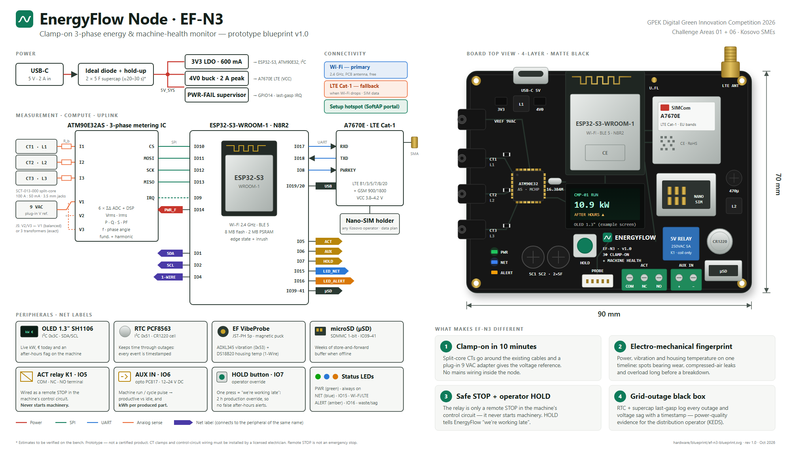

# EnergyFlow Hardware — EF-N3 Node

**EF-N3** is EnergyFlow's own monitoring device: a **clamp-on 3-phase energy and machine-health node** for SME machinery such as compressors, injection moulders, CNC machines, chillers and pumps. It is the same idea as the SproutSync Cube (ESP32 + sensors + Wi-Fi/cellular, synced to the app), rebuilt around the problem EnergyFlow solves.

| File | What |
|---|---|
| [`blueprint/ef-n3-blueprint.png`](blueprint/ef-n3-blueprint.png) (+ `.svg`) | Schematic + board top view, 90 × 70 mm |
| [`blueprint/ef-n3-installation.png`](blueprint/ef-n3-installation.png) (+ `.svg`) | Installation on a 3-phase machine, control-circuit wiring, data path, install steps |
| [`reference/`](reference/) | SproutSync Cube-Monitor references this design builds on |

> **Status: prototype design (rev 1.0, Oct 2026).** Not a certified product. Values marked * are estimates to be verified on the bench.



---

## 1. What is new (and why it matters to a Kosovo SME)

| # | Feature | Why it's different | What it enables in EnergyFlow |
|---|---|---|---|
| 1 | **Clamp-on in ~10 minutes, no mains wiring.** Split-core CTs clip around existing cables; a plug-in 9 VAC adapter gives the voltage reference (the proven OpenEnergyMonitor / CircuitSetup approach). | Most SMEs can't shut a machine down to install a meter. Nothing on the node touches 230/400 V. | Per-machine kWh, kW, PF, V, f, energy, cost and CO₂ |
| 2 | **Electro-mechanical fingerprint.** Electrical data + **EF VibeProbe** (magnetic puck: ADXL345 vibration + DS18B20 housing temperature) on one timeline. | Energy meters see power; vibration loggers see motion. EF-N3 sees both, so it can tell *why* consumption changed. | Fingerprint drift, bearing-wear and overload warnings, compressed-air leak signature |
| 3 | **Safe STOP + operator HOLD.** The relay is wired *only* as a remote STOP in the machine's existing control circuit (NC contact in series with the STOP button). **HOLD** lets an operator say "we're working late". | EnergyFlow can stop wasted after-hours running, but **can never start a machine**. If the node fails, the machine behaves exactly as before. | The *Turn Off* action, verified by the meter, plus automatic production overrides (no false alerts for planned overtime) |
| 4 | **Grid-outage black box.** RTC + supercapacitor last-gasp + sag/phase-loss detection on the metering IC. | Outages and voltage sags damage motors and are hard to prove. | Timestamped power-quality log, evidence for complaints to the distribution operator (KEDS) |
| 5 | **Production-aware (AUX IN).** An opto-isolated 12–24 V input reads the machine's run/cycle signal. | Separates productive from idle consumption without guessing. | **kWh per produced part**, an intensity metric for ESG reports and CBAM context |
| 6 | **€ on the machine.** A 1.3″ OLED shows live kW, € today and an after-hours flag. | Workers see the cost where the waste happens. | Behaviour change on the shop floor |
| 7 | **Wi-Fi first, real LTE fallback, store-and-forward.** | Production halls often have weak Wi-Fi. ⚠ SproutSync's SIM800L is **2G-only**; EF-N3 uses an **A7670E LTE Cat-1** (EU bands B1/B3/B5/B7/B8/B20, with GSM fallback). | No data gaps; works where there's no Wi-Fi |

---

## 2. Block design

```
 USB-C 5 V ─► ideal diode + 2×5 F hold-up ─► 5V_SYS ─┬─► 3V3 LDO ─► ESP32-S3, ATM90E32AS, I²C
                                                     ├─► 4V0 buck (2 A peak) ─► A7670E LTE
                                                     └─► PWR-FAIL supervisor ─► GPIO14 (last-gasp)

 CT1/CT2/CT3 (SCT-013-000) ─► burden ─► ATM90E32AS I1–I3 ─┐
 9 VAC adapter ─► divider ─► V1 (J5: V2/V3 ← V1 or 3 refs) ┤ SPI ─► ESP32-S3-WROOM-1 ─ UART ─► A7670E ─► SMA
                                                          │          │  Wi-Fi (PCB antenna)
 I²C: OLED SH1106 · RTC PCF8563 · VibeProbe ADXL345        └──────────┤  1-Wire: DS18B20 (VibeProbe)
 ACT relay (remote STOP) · AUX IN opto · HOLD button · LEDs · µSD ────┘
```

### Pin map (ESP32-S3-WROOM-1-N8R2)

| GPIO | Function | Notes |
|---|---|---|
| 10 / 11 / 12 / 13 | ATM90E32AS CS / MOSI / SCK / MISO | SPI |
| 9 | ATM90E32AS IRQ / WarnOut | sag, phase-loss, metering warnings |
| 14 | PWR_FAIL | 5 V supervisor output → last-gasp routine |
| 17 / 18 | UART1 TX → A7670E RXD / RX ← A7670E TXD | LTE modem |
| 8 | A7670E PWRKEY | modem power sequencing |
| 19 / 20 | USB D− / D+ | native USB: flashing and logs |
| 1 / 2 | I²C SDA / SCL | OLED 0x3C, RTC 0x51, ADXL345 0x53 |
| 4 | 1-Wire | DS18B20 in the VibeProbe |
| 5 | ACT relay driver | NPN/MOSFET + flyback diode; contacts COM/NC/NO |
| 6 | AUX IN | PC817 opto, 12–24 V DC run/cycle signal |
| 7 | HOLD button | operator override |
| 15 / 16 | LED NET (blue) / LED ALERT (amber) | PWR LED (green) is on the 3V3 rail |
| 39 / 40 / 41 | microSD CLK / CMD / D0 | SDMMC 1-bit |
| 0 | BOOT | strapping pin, button only |

GPIO 35–37 are left free (reserved by octal PSRAM variants).

---

## 3. Bill of materials (indicative)

> Prices are **rough market estimates (Oct 2026, excl. VAT and shipping)** for prototype quantities. Verify with suppliers before quoting them anywhere.

| Part | Example | Qty | Est. € |
|---|---|---|---|
| MCU module | ESP32-S3-WROOM-1-N8R2 | 1 | 3–5 |
| Metering IC + crystal | Microchip ATM90E32AS + 16.384 MHz | 1 | 4–8 |
| LTE modem | SIMCom A7670E (LTE Cat-1, GSM fallback) | 1 | 8–14 |
| Nano-SIM holder, SMA edge + LTE antenna, u.FL | — | 1 | 3–6 |
| Current transformers | YHDC SCT-013-000, 100 A : 50 mA, split-core | 3 | 15–27 |
| Voltage reference adapter | 9 VAC plug-in transformer (EU plug) | 1 | 7–12 |
| Power adapter | USB-C 5 V / 2 A | 1 | 4–7 |
| Power path | ideal-diode IC, 2 × 5 F / 2.7 V supercaps + balancing, 3V3 LDO, 4V0 buck | 1 | 3–6 |
| Relay output | 5 V relay, 250 VAC / 5 A, driver + flyback | 1 | 1–2 |
| AUX input | PC817 optocoupler + resistors | 1 | < 1 |
| Display | 1.3″ OLED SH1106 (I²C) | 1 | 3–5 |
| RTC | PCF8563 + CR1220 holder and cell | 1 | 1–2 |
| Storage | microSD socket | 1 | < 1 |
| VibeProbe | ADXL345 + DS18B20 + neodymium puck + JST-PH cable | 1 | 5–8 |
| PCB | 90 × 70 mm, 4-layer (prototype batch) | 1 | 2–6 |
| Enclosure | DIN-rail enclosure (or ABS box + magnet plate) | 1 | 5–10 |
| **Total, full kit** | | | **≈ 65–120** |

The design target is **under €100 per complete 3-phase kit**. At volume the board alone (without CTs and adapters) should land well below that.

### Power budget*

| Mode | Est. draw |
|---|---|
| Wi-Fi, metering, OLED on | ≈ 0.5–0.8 W |
| LTE transmitting (bursts) | up to 2 A peaks on 4V0, which the 470 µF bulk capacitor absorbs |
| Annual self-consumption | ≈ 5–8 kWh/year, versus savings typically measured in hundreds of kWh |

---

## 4. Safety design

1. **The node never carries mains.** CTs are non-invasive, the voltage comes from a 9 VAC isolating adapter, and power comes from a USB-C adapter.
2. **Remote STOP only.** ACT's **NC** contact is wired *in series with the machine's existing STOP button*, inside its control circuit (24 V or 230 V coil circuit). Opening it is the same as pressing STOP. The contactor's self-hold drops out, so **only the machine's own START button can restart it.** EF-N3 never switches motor current and never starts machinery.
3. **Fail-safe = fail-to-run.** When the node is unpowered, crashed or reset (hardware watchdog), the relay de-energises, NC closes and the machine works exactly as before the installation.
4. **The emergency-stop chain is never touched.** Remote STOP is not an E-stop.
5. **Software guardrails** ([docs/03-architecture.md §10.3](../docs/03-architecture.md)):
   - machines flagged `critical` cannot be switched
   - control modes (`monitor`, `notify`, `approve`, `auto`)
   - HOLD/production overrides are respected
   - full audit log
   - every command is **verified by the meter**.
6. Installing the CT clamps in a panel and wiring the control circuit must be done by a **licensed electrician**, following the machine's risk assessment.

---

## 5. Firmware (ESP32-S3, Arduino-ESP32 / PlatformIO)

| Task | Rate | Job |
|---|---|---|
| Metering | 1 s | Read Vrms, Irms, P, Q, PF, f and energy per phase from ATM90E32AS; aggregate 10 s windows (mean/min/max). On an on/off step, poll Irms quickly for ~2 s to capture the **start-up peak**. |
| Health | 10 s | ADXL345 at 800 Hz → acceleration RMS (g) per 10 s window; DS18B20 housing temperature |
| Edge state | 1 s | OFF / IDLE / RUNNING with hysteresis; emits `start` / `stop` events |
| Uplink | 10 s | Batch → HTTPS `POST /api/v1/ingest/readings`, HMAC-signed. Wi-Fi first, LTE fallback. Ring buffer in flash (≈ days) or µSD (weeks); oldest-first replay with `seq`. |
| Commands | each uplink | The response carries `pending_commands`; the node fetches `GET /api/v1/device/commands`, opens ACT, then sends `POST …/ack`. The server verifies by watching power drop. |
| UI | 1 s | OLED pages (kW / € today / state); LEDs; HOLD press → `hold` event (2 h override) |
| Power fail | IRQ | PWR_FAIL → write an outage marker with the RTC timestamp → last-gasp POST on Wi-Fi → sleep. On restore → `outage` event with its duration. |
| Provisioning | first boot | SoftAP captive portal (SSID `EnergyFlow-XXXX`): pick Wi-Fi, enter the device secret (or claim code). Same idea as the SproutSync hotspot. |

### Telemetry payload (protocol v1; the API is the same for real and simulated devices)

```json
{
  "device": "EF-101",
  "fw": "0.1.0",
  "seq": 18233,
  "readings": [
    { "ch": 1, "ts": "2026-11-15T20:47:10Z", "v": 231.4, "i": 27.9, "p_kw": 11.12, "pf": 0.86,
      "f": 50.01, "e_kwh": 15234.551, "t_c": 48.2, "vib_g": 0.042 }
  ],
  "events": [
    { "ch": 1, "ts": "2026-11-15T20:46:52Z", "type": "start", "peak_a": 96.0 },
    { "ts": "2026-11-15T20:30:00Z", "type": "hold", "minutes": 120 },
    { "ts": "2026-11-15T18:02:11Z", "type": "outage", "duration_s": 42 },
    { "ch": 1, "ts": "2026-11-15T20:47:10Z", "type": "aux_pulse", "count": 3 }
  ],
  "status": { "rssi": -61, "uptime_s": 86400, "buffered": 0, "net": "wifi" }
}
```

Headers: `Authorization: Device <device-key>`, `X-EF-Timestamp`, and `X-EF-Signature = hex(HMAC-SHA256(secret, timestamp + "." + body))`.

---

## 6. Prototype plan (what we can actually build before Demo Day)

| Stage | Build | Proves | When |
|---|---|---|---|
| **P0 — bridge** | A certified metering smart plug + `tools/hw-bridge` on the laptop | The ingest API and Turn Off loop end-to-end with a real lamp, zero mains risk | First, fastest |
| **P1 — dev build** | ESP32-S3 DevKitC + ATM90E32 breakout + 1 SCT-013 on an **AC line-splitter** (a clamp-meter accessory, so the CT goes around a single conductor safely) + 9 VAC adapter + OLED + RTC + VibeProbe + relay module + HOLD button | Our firmware, our measurements, HOLD, outage logging | ~1–2 weeks after parts arrive |
| **P2 — Demo Day panel** | P1 in a DIN enclosure + a small **demo panel built by an electrician**: contactor with a 24 V coil, START/STOP buttons, EF-N3 ACT (NC) in series, driving a fan or lamp | The full safe-STOP loop on stage: *Turn Off* in the app → the fan stops → the meter verifies → only START restarts | Final week |
| **P3 — custom PCB rev A** | 90 × 70 mm 4-layer board (JLCPCB fab + assembly), 3 phases, LTE | Product form factor, cost | After the hackathon / pilot |

## 7. Bench-test plan

| Test | Pass criterion |
|---|---|
| Calibration vs a reference meter at 3 loads (≈60 W, 1 kW, 2 kW) | Active power error ≤ 2 % after calibration |
| Unplug the socket (outage) | Last-gasp event received; RTC timestamp correct; measured hold-up time recorded |
| Node power-off / firmware hang | Relay releases (NC closed) and the machine keeps running |
| Wi-Fi blocked for 1 h | No data gaps after reconnect; `seq` continuous |
| LTE fallback | Data resumes over LTE within 60 s |
| VibeProbe on a fan, then add imbalance (coin on a blade) | Vibration RMS clearly rises; fingerprint drift flagged |
| HOLD pressed | A 2 h production override appears in EnergyFlow; no after-hours alert |
| Self-consumption | Measured with a USB power meter and recorded in this README |

## 8. Road to a product

CE marking (EMC/LVD for the node; the CTs and adapters are bought certified), OTA updates, an enclosure with a magnetic back and DIN clip, a Modbus RS-485 option to read existing certified meters, ISO 20816 velocity-based vibration with a lower-noise MEMS sensor, and multi-node ESP-NOW for large halls.

### Sources
- ATM90E32AS (Microchip poly-phase metering IC): [datasheet summary](https://www.radiolocman.com/datasheet/data.html?di=428123), [Farnell listing](https://it.farnell.com/en-IT/microchip/atm90e32as-au-y/energy-metering-ic-40-to-85deg/dp/2991833)
- Clamp-on CT + 9 VAC reference approach: [CircuitSetup energy meter (ESPHome)](https://devices.esphome.io/devices/CircuitSetup-Split-Single-Phase-Energy-Meter-ATM90E32-with-ESP32/), [ESPHome ATM90E32 component](https://esphome.io/components/sensor/atm90e32/)
- A7670E LTE Cat-1: [Waveshare A7670E](https://www.waveshare.com/product/iot-communication/long-range-wireless/a7670e-cat-1-gnss-hat.htm), [everything RF](https://everythingrf.com/products/cellular-modules/simcom/811-765-a7670e)
